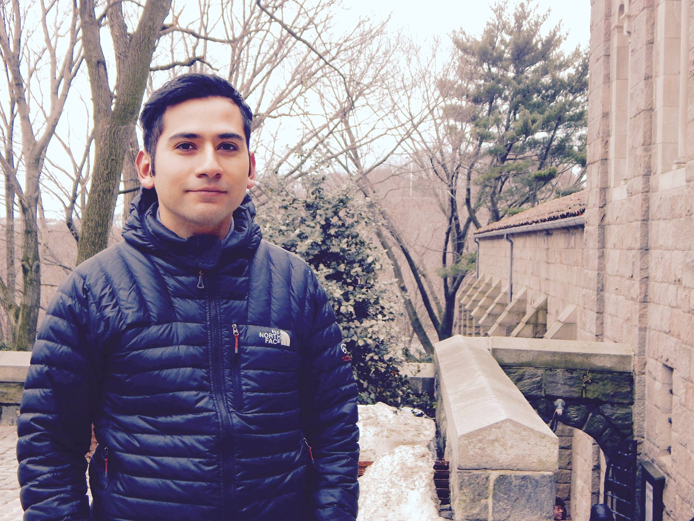

<h1 align="center" style={{marginTop: "2em"}}>Husband. Scientist. Trail Runner.</h1>

Creativity and imagination are great starting places, but hard-headed thinking and extreme attention to detail are essential to success.

-Jet Propulsion Laboratory

 

## Statement

Data Scientist with a B.S. in Astronomy and a certificate in Data Science and Visualization from the University of California. Exceptional analytical and conceptual thinking skills that drive an unquenchable, technical curiosity to find truths embedded in any dataset. Passionate about utilizing a scientific mindset when developing incredibly fast, efficient, and insightful solutions at high-performing companies where modern analysis toolkits are conventional. Senior-level experience using Python, VBA, Excel, Numpy, Pandas, Scipy, Astropy statistical modules and data visualization libraries like Bokeh and Matplotlib. Understands and teaches best practices when developing applications that directly affects the operational execution of any organization. My eagerness to adopt new ways of solving complex problems enables me to adapt quickly into new or changing team environments.

 

## Biography

I, David Jaimes, a native San Diegan from California, received my B.S. in astronomy from San Diego State University (SDSU) in 2013. At SDSU, my research with Eric L. Sandquist focused on investigating the age of the old open cluster, NGC 6819.

I also worked for Astronomical Research Cameras, assembling controllers and multiplexors for the Visible Integral Field Replicable Unit Spectrographs (VIRUS) used by the Hobby-Eberly Telescope Dark Energy Experiment project at the University of Texas, Austin.

During the Bridge to the Ph.D. Program, I worked with Marcel A. Agüeros on the young open cluster, Alpha Persei. The new rotation periods that I measured for stars in this cluster would be used to calibrate and anchor the relationship between stellar age and rotation.

Thanks to the efforts of the Bridge to the Ph.D. Program, I moved to California and was pursuing an M.S. in astronomy at SDSU. I was working with Robert W. Quimby, Director of the Mount Laguna Observatory, to classify spectra (usually supernovae) taken with the 60-inch telescope at Palomar Mountain.

In 2017, I took a leave of absence from SDSU and put my thesis project on hold to help my wife immigrate to the United States. I plan to finish my graduate studies at some point in the future when the opportunity arises. For now, I am pursuing a career in data science, data enigineering, data analysis, or software enigineering.

 

## Books

Books currently reading.

Title | Author
:--- | :----
Hyperion | Dan Simmons
Dark Matter and the Dinosaurs | Lisa Randall
Cthulhu Mythos Tales | H.P. Lovecraft
Heart of Darkness | Jeremiah P. Ostriker and Simon Mitton
Build Your Running Body | Pete Magill, Thomas Schwartz, and Melissa Breyer
Legado Astronomico | J. Daniel Flores Guitierrez, Margarita Rosado Solis, y Jose Franco Lopez
Python for Data Analysis: 2nd Edition | Wes McKinney
Python Data Science Handbook | Jake VanderPlas
