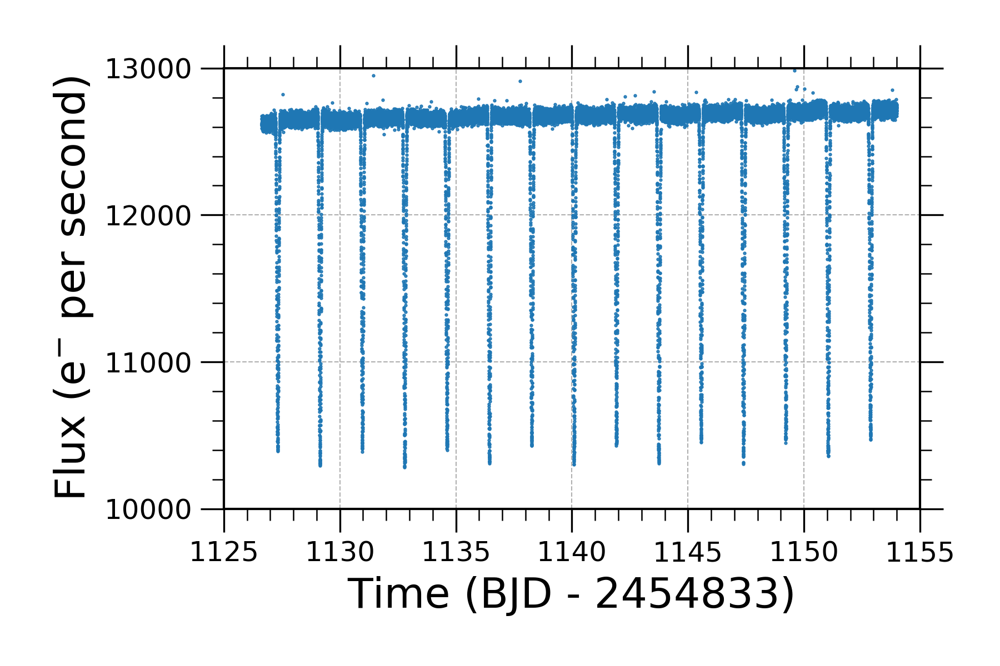
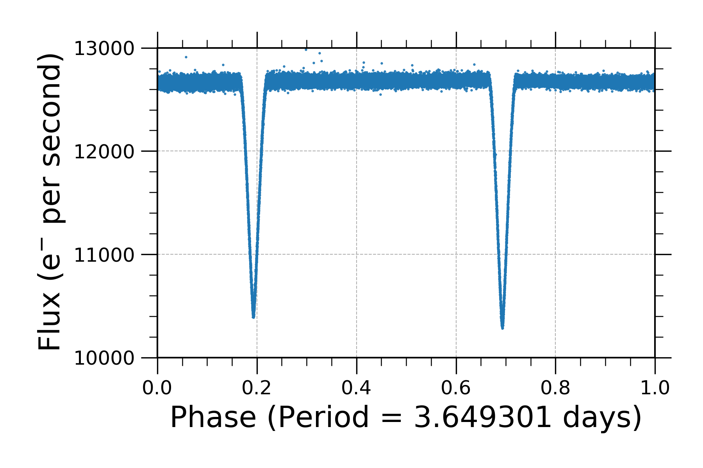

<h1 align="center" style={{marginTop: "2em"}}><b>KOI-3570:</b> An Eclipsing Binary Star System</h1>

<br/><br/>

Time series analysis in search for eclipsing binary stars can be daunting. Sometimes, it takes hours--even days or months--to find a single eclipsing binary in a dataset. However, when you find one, it is exciting. The following is an example light curve for target Kepler Object of Interest (KOI) 3570.

<br/><br/>

## KOI-3570

**KOI-3570** (aliases: **2MASS J19405783+4009273**, **KIC 5023948**, and **WISE J194057.82+400927.3**) is an eclipsing binary star system. It is a member of the old open cluster NGC 6819. By analyzing the eclipse properties of this system, we can measure the mass and radius of each star. These measurements can be used to precisely determine the age of the stars.

<br/><br/>

## Getting the data: FITS file

If you're familiar getting FITS files, then download the data from [Nasa Exoplanet Archive][1]. I downloaded the following batch file ```download_exoarch_27821.bat``` from the archive.

```bash
wget -v -O 'kplr005023948-2012060035710_slc_lc.tbl' 'http://exoplanetarchive.ipac.caltech.edu:80/data/ETSS//Kepler/005/756/03/kplr005023948-2012060035710_slc_lc.tbl'
```

<br/>

If you don't have the `wget` command installed in your system, then I recommend installing [Homebrew][2] and using the following command:

```batch
brew install wget
```

<br/><br/>

## Lightcurve

Use [AstroPy][3] to plot a lightcurve (flux vs time) for KOI-3570. I am using `kplr005023948-2012060035710_slc.fits` because it has the greatest amount of data points in any file on the batch list--over 40,000 points.

```python
from astropy.io import fits
import matplotlib.pyplot as plt

hdu = fits.open('kplr005023948-2012060035710_slc.fits')
time = hdu[1].data['TIME']
flux = hdu[1].data['SAP_FLUX']
plt.plot(time, flux, '.', markersize=1)
```

<br/>



<br/>

## Phase Fold Lightcurve

Arguably, one of the most important parameters to find for an eclipsing binary star system is the orbital period. There are many ways to find the period around the center of mass and the method I like to use is a multi-term Lomb-Scargle approach. For this system, I used the period published in Brewer et al. 2016. They found an orbital period of 3.649301 days. Phase folding the light curve with this orbital period yields the following plot. The secondary and primary eclipses are at about phase equal to 0.2 and 0.7, respectively.

```python
period = 3.649301
phase = (time - time[0]) / period % 1
plt.plot(phase, flux, '.', markersize=1)
```

<br/>



<br/>

## References
1. [Nasa Exoplanet Archive][1]
2. [Homebrew][2]
3. [AstroPy][3]

[1]: https://exoplanetarchive.ipac.caltech.edu
[2]: https://brew.sh/
[3]: https://www.astropy.org/
