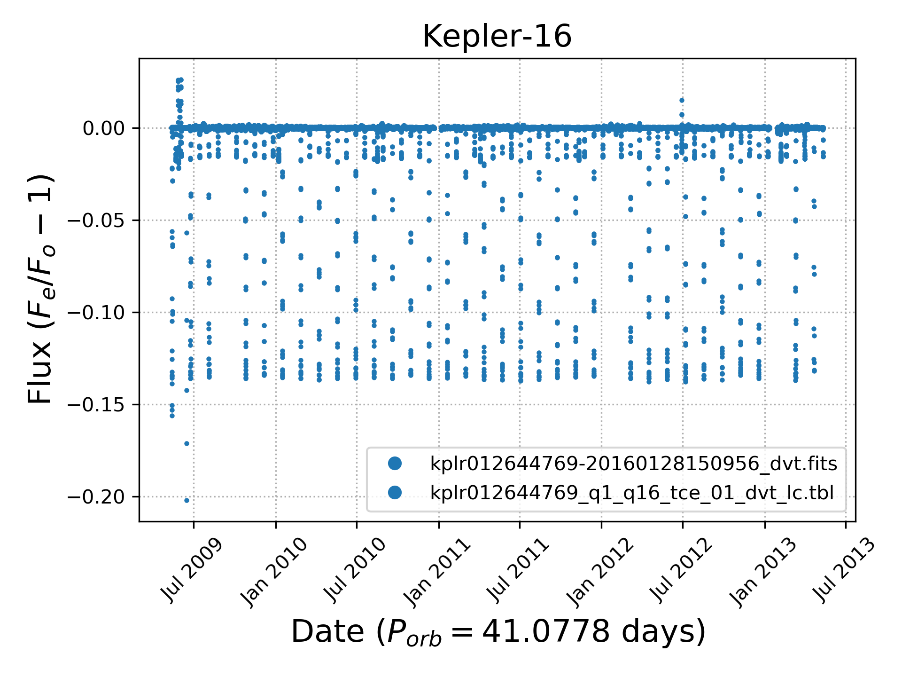

import {Image, Badge, Card, Button, Row, Col} from "react-bootstrap"
import {MountLaguna} from "../images/mount-laguna.jpg"
import Logo from "../images/favicon.png"


<Image src={Logo} style={{height: "80px"}} className="mb-5"/>
<Badge variant="success">1.0.05</Badge>

# A Collection of Data Science Tools and Visualizations for Developers and Engineers

<p className="text-muted">
Discover the many different ways to collect, analyze, and distribute data gathered from different sources. This is a one-stop shop to build and deploy your own project with easy to follow instructions.
</p>

<Card className="shadow mt-5 mb-5">
  <Card.Body>
    <Card.Title><Button variant="outline-primary stretched-link">Python</Button> <small className="text-muted">https://www.python.org/</small></Card.Title>
    <Card.Text>
    Python is a programming language that lets you work more quickly and integrate your systems more effectively.
    </Card.Text>
  </Card.Body>
</Card>

### Features

- Open-source programming language.
- Simple and readable syntax.
- Popularity is trending and growing.
- Build all tyoes of software.

*Recommended:* Use the **Miniconda** or **Anaconda** distribution for easy installation and configuration. Then, import your favorite libraries and try out the following example for plotting the first circumbinary star system, Kepler-16:

```python
from astropy.io import fits, ascii
from astropy.time import Time
import matplotlib.pyplot as plt
from matplotlib.dates import DateFormatter
import pandas as pd


fname = 'kplr012644769-20160128150956_dvt.fits'
hdu = fits.open(fname)
data = hdu[1].data
df = pd.DataFrame({'time': data['TIME'], 'flux': data['LC_INIT']})
df['time'] = Time(df['time'] + 2454833, format='jd').datetime64
plt.plot(df['time'], df['flux'], '.', ms=3, label=fname)

fname = 'kplr012644769_q1_q16_tce_01_dvt_lc.tbl'
data = ascii.read(fname)
df = pd.DataFrame({'time': data['TIME'], 'flux': data['INIT_FLUX_PL']})
df['time'] = Time(df['time'] + 2454833, format='jd').datetime64
plt.plot(df['time'], df['flux'], '.', ms=3, c='C0', label=fname)

plt.title('Kepler-16', size=16)
plt.xlabel(r'Date ($P_{orb}=41.0778$ days)', size=16)
plt.ylabel(r'Flux ($F_e/F_o - 1$)', size=16)

date_form = DateFormatter("%b %Y")
plt.gca().xaxis.set_major_formatter(date_form)

plt.xticks(rotation=45)
plt.grid(ls=':')
plt.legend(markerscale=4)
plt.tight_layout()
plt.savefig('kepler-16.png', dpi=300)
```



<Card className="shadow mt-5 mb-5">
  <Card.Body>
    <Card.Title><Button variant="outline-primary stretched-link">Miniconda</Button> <small className="text-muted">https://docs.conda.io/en/latest/miniconda.html</small></Card.Title>
    <Card.Text>
    Miniconda is a free minimal installer for conda. It is a small, bootstrap version of Anaconda that includes only conda, Python, the packages they depend on, and a small number of other useful packages, including pip, zlib and a few others. Use the <code>conda install command</code> to install 720+ additional conda packages from the Anaconda repository.
    </Card.Text>
  </Card.Body>
</Card>

### Setup

Download the latest bash file from the [Miniconda](https://docs.conda.io/en/latest/miniconda.html) page and install with the following command:

```bash
bash Miniconda3-latest-MacOSX-x86_64.sh
```

Update conda and initialize zsh environment for macOS Catalina users:

```bash
conda update conda
conda init zsh
```

Install all Python libraries at once (NumPy and SciPy will also be installed):

```bash
conda install matplotlib pandas astropy notebook scikit-learn
```

<Card className="shadow mt-5 mb-5">
  <Card.Body>
    <Card.Title><Button variant="outline-primary stretched-link">Sublime Text</Button> <small className="text-muted">https://www.sublimetext.com/</small></Card.Title>
    <Card.Text>
    A sophisticated text editor for code, markup and prose.
    </Card.Text>
  </Card.Body>
</Card>

### Settings

Preferences.sublime -setings -- User:

```js
{
	"color_scheme": "Packages/Theme - Gravity/One Dark Gravity.tmTheme",
	"font_size": 13,
	"gravity_highlight_color_blue": true,
	"gravity_tab_font_small": true,
	"gravity_tab_height_short": true,
	"gravity_title_bar": true,
	"ignored_packages":
	[
		"Vintage"
	],
	"open_files_in_new_window": false,
	"theme": "Gravity One.sublime-theme",
	"word_wrap": true
}
```

<br/>

### Features

- **GoTo Anything:** Use Goto Anything to open files with only a few keystrokes, and instantly jump to symbols, lines or words.
- **Multiple Selections:** Make ten changes at the same time, not one change ten times. Multiple selections allow you to interactively change many lines at once, rename variables with ease, and manipulate files faster than ever.
- **Powerful API:** Sublime Text has a powerful, Python API that allows plugins to augment built-in functionality.
- **Split Editing:** Get the most out of your wide screen monitor with split editing support. Edit files side by side, or edit two locations in the one file. You can edit with as many rows and columns as you wish. Take advantage of multiple monitors by editing with multiple windows, and using multiple splits in each window.
- **Performance:** Sublime Text is built from custom components, providing for unmatched responsiveness. From a powerful, custom cross-platform UI toolkit, to an unmatched syntax highlighting engine, Sublime Text sets the bar for performance.
- **Command Palette:** The Command Palette holds infrequently used functionality, like sorting, changing the syntax and changing the indentation settings. With just a few keystrokes, you can search for what you want, without ever having to navigate through the menus or remember obscure key bindings.
- **Customize Anything:** Key bindings, menus, snippets, macros, completions and more - just about everything in Sublime Text is customizable with simple JSON files. This system gives you flexibility as settings can be specified on a per-file type and per-project basis.
- **Cross Platform:** Sublime Text is available for Mac, Windows and Linux. One license is all you need to use Sublime Text on every computer you own, no matter what operating system it uses.