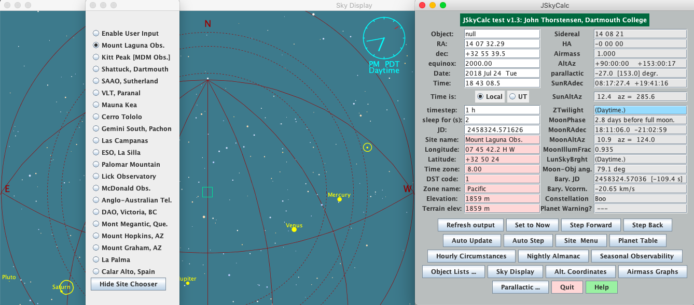

<h1 align="center" style={{marginTop: "2em"}}><b>JSkyCalc:</b> A convinient, portable observing aid.</h1>

<br/><br/>

**JSkycalc** expedites the "time-and-the-sky" calculations needed by observational astronomers. To follow the original directions on setting up JSkyCalc on your computer, go to [John Thorstensen's][2] website. His directions might be a little outdated (from year 2008) but they still work.

<br/><br/>

## Installing JSkyCalc on macOS
<hr/>
<br/>

### 1. Download .jar File

Go to [John Thorstensen's][2] website and download the `JSkyCalc.jar` executable jar file.

<br/>

### 2. Create a New Directory in Home Folder

I suggest creating a new folder in your home directory and placing the jar file in there. If your jar file is in your Downloads folder after downloading from John's site, you can copy paste the three commands to your terminal and you should end up in your `jskycalc` directory, under your home folder.

```bash
mkdir ~/jskycalc
```

```shell
mv ~/Downloads/JSkyCalc.jar ~/jskycalc
```

```shell
cd ~/jskycalc
```

<br/>

### 3. Install Oracle-Java JDK Download

Run the java command on the jar file and it should start right up. If you don't have java installed in your system you will get a messege. Click on "more info" and it will take you to the [Oracle-Java][1] website.  Click on "Oracle JDK Download" button from **Java SE 14** section and then download the `jdk-14.0.1_osx-x64_bin.dmg` file.

```shell
java -jar JSkyCalc.jar
```

<br/>



<br/><br/>

### 4. Unpack Files from Jar File

To add Mount Laguna Observatory to JSkyCalc, start by unpacking the jar file.

```shell
jar -xvf JSkyCalc.jar
```

<br/>

### 5. Add a New Site Location as Default

Open `skycalcsites.dat` and add Mount Laguna Observatory as the first site (above Kitt Peak)--it will become the default.

```
"Mount Laguna Obs.", 7.76173, 32.84, 8., 1, "Pacific", "P", 1859., 1859.
```

<br/>

### 6. Save Changes to Jar File

Reconstruct the jar file and all the changes will take effect.

```shell
jar -cvmf myManifest.mf JSkyCalc.jar .
```

<br/>

## Environment setup
7. Add following lines to your `~/.bash_profile` file and you will be able to start JSkyCalc from any directory.

   ```bash
   # use jsky command in any directory to start JSkyCalc
   alias jsky='java JSkyCalc'
   CLASSPATH=$CLASSPATH:~/JSkyCalc
   export CLASSPATH
   ```
8. Finally, use the command `source ~/.bash_profile` to source the file and then use jsky command to start using JSkyCalc from any directory!
8. The following line is the general format for JSkyCalc (.dat) files:

   ```
   Name_no_blanks hh mm ss dd mm ss equinox +++
   ```

   It's fine if all your stars have equinox=2000. Here is an example of `observe-star.dat` formatted for JSkyCalc.

   ```
   some_star 00 37 52.92 -09 42 16.5 2000.0 +++
   ```

## References
1. [Oracle-Java][1]
2. [JSkyCalc][2]

[1]: https://www.oracle.com/technetwork/java/javase/downloads/index.html
[2]: https://www.dartmouth.edu/~physics/labs/skycalc/flyer.html

[jskycalc-install]: ../../images/jskycalc-install.png
