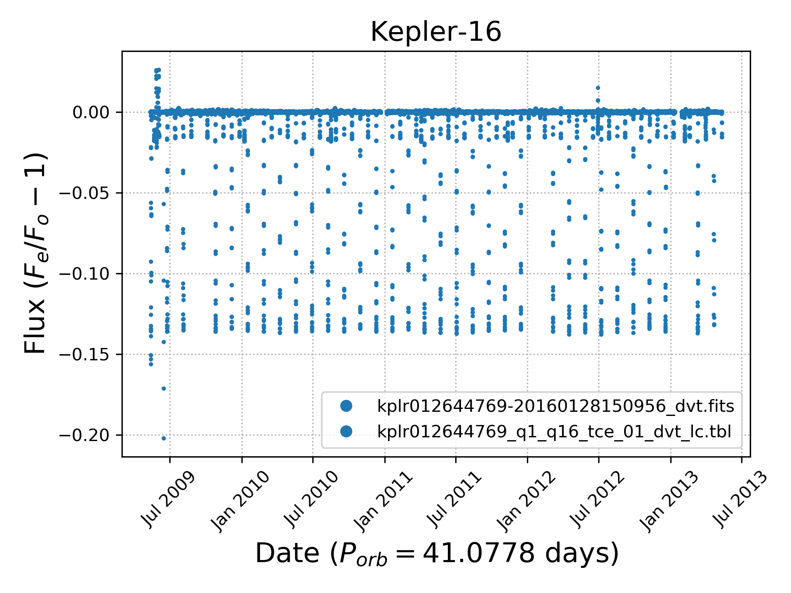

<h1 align="center" style={{marginTop: "2em"}}><b>Kepler-16b:</b> The First Circumbinary Planet</h1>

<br/><br/>

**Kepler-16b** (formally **Kepler-16 (AB)-b**) is an extrasolar planet. It is a Saturn-mass planet consisting of half gas and half rock and ice, and it orbits a binary star, Kepler-16, with a period of 229 days. "It is the first confirmed, unambiguous example of a circumbinary planet – a planet orbiting not one, but two stars," said Josh Carter of the Harvard-Smithsonian Center for Astrophysics, one of the discovery team.

<h2 style={{marginTop: "2em"}}>Kepler Mission Data</h2>

The Kepler Mission, a NASA Discovery mission launched on March 6, 2009, was the first space mission dedicated to the search for Earth-sized and smaller planets in the habitable zone of other stars in our neighborhood of the galaxy. Visit the [NASA Exoplanet Archive](https://exoplanetarchive.ipac.caltech.edu/index.html) website to find the data files for Kepler-16, the eclipsing binary star system, or any other Kepler Object of Interest (KOI) out there. The following lines can copied over to the command line on your terminal window to automatically download:

```bash
wget -v -O 'kplr012644769-20160128150956_dvt.fits' 'http://exoplanetarchive.ipac.caltech.edu:80/data/ETSS//KeplerDV/005/713/24/kplr012644769-20160128150956_dvt.fits'
wget -v -O 'kplr012644769_q1_q16_tce_01_dvt_lc.tbl' 'http://exoplanetarchive.ipac.caltech.edu:80/data/ETSS//KeplerDV/000/866/64/kplr012644769_q1_q16_tce_01_dvt_lc.tbl'
```

<br/>

**Flexible Image Transport System (FITS)** is an open standard defining a digital file format useful for storage, transmission and processing of data: formatted as multi-dimensional arrays (for example a 2D image), or tables. FITS is the most commonly used digital file format in astronomy. The FITS standard was designed specifically for astronomical data, and includes provisions such as describing photometric and spatial calibration information, together with image origin metadata. Visit the [AstroPy.org](https://docs.astropy.org/en/stable/io/fits/) documentation page to learn how to work with FITS files.

<h2 style={{marginTop: "2em"}}>Matplotlib to Visualize Transits</h2>

**Matplotlib** is a comprehensive library for creating static, animated, and interactive visualizations in Python.

Import all the Python dependencies:

```python
from astropy.io import fits, ascii
from astropy.time import Time
import matplotlib.pyplot as plt
from matplotlib.dates import DateFormatter
import pandas as pd
```

<br/>

Use `astropy.io.fits` to read in the FITS file:

```python
fname = 'kplr012644769-20160128150956_dvt.fits'
hdu = fits.open(fname)
data = hdu[1].data
df = pd.DataFrame({'time': data['TIME'], 'flux': data['LC_INIT']})
df['time'] = Time(df['time'] + 2454833, format='jd').datetime64
plt.plot(df['time'], df['flux'], '.', ms=3, label=fname)
```

<br/>

Use `astropy.io.ascii` to read in the TBL file:

```python
fname = 'kplr012644769_q1_q16_tce_01_dvt_lc.tbl'
data = ascii.read(fname)
df = pd.DataFrame({'time': data['TIME'], 'flux': data['INIT_FLUX_PL']})
df['time'] = Time(df['time'] + 2454833, format='jd').datetime64
plt.plot(df['time'], df['flux'], '.', ms=3, c='C0', label=fname)
```

<br/>

Add names to your labels:

```python
plt.title('Kepler-16', size=16)
plt.xlabel(r'Date ($P_{orb}=41.0778$ days)', size=16)
plt.ylabel(r'Flux ($F_e/F_o - 1$)', size=16)
```

<br/>

Use `matplotlib.dates.DateFormatter` to chage dates from **YYYY-MM-DD** to **MMM YYYY** format:

```python
date_form = DateFormatter("%b %Y")
plt.gca().xaxis.set_major_formatter(date_form)
```

<br/>

Add final layout options:

```python
plt.xticks(rotation=45)
plt.grid(ls=':')
plt.legend(markerscale=4)
plt.tight_layout()
plt.savefig('kepler-16.png', dpi=300)
```

<br/><br/>

